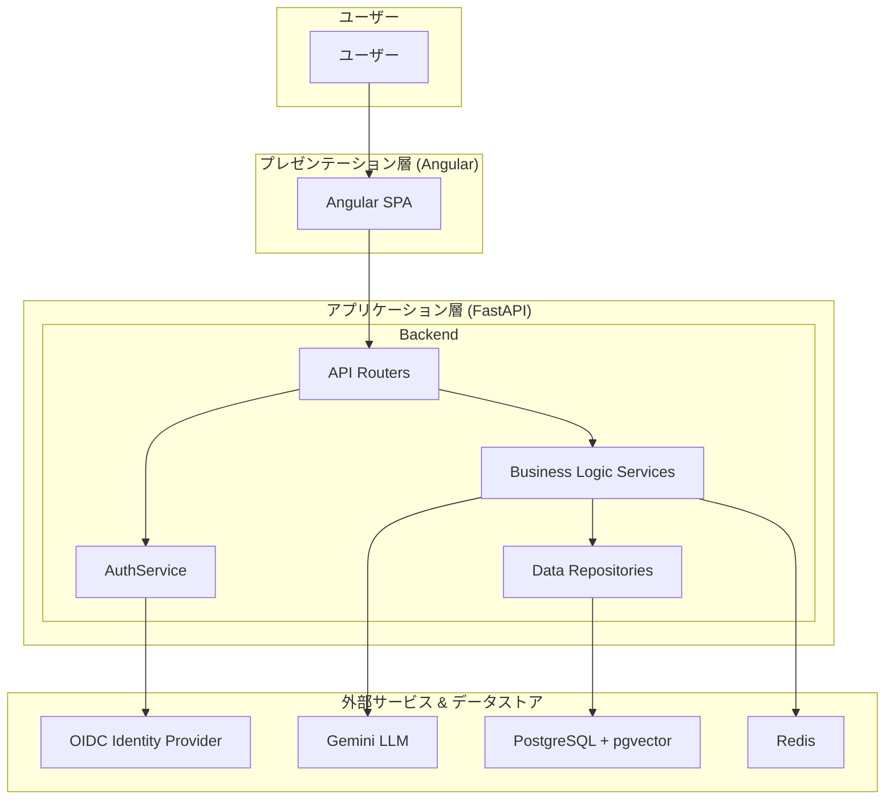
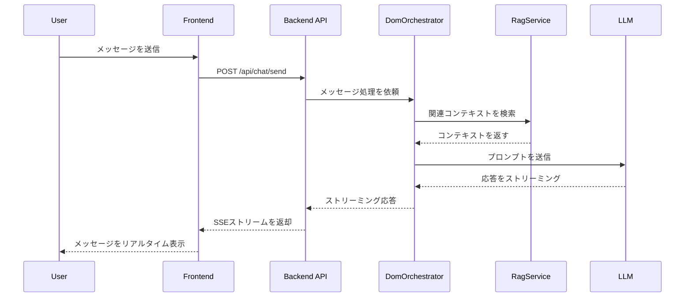
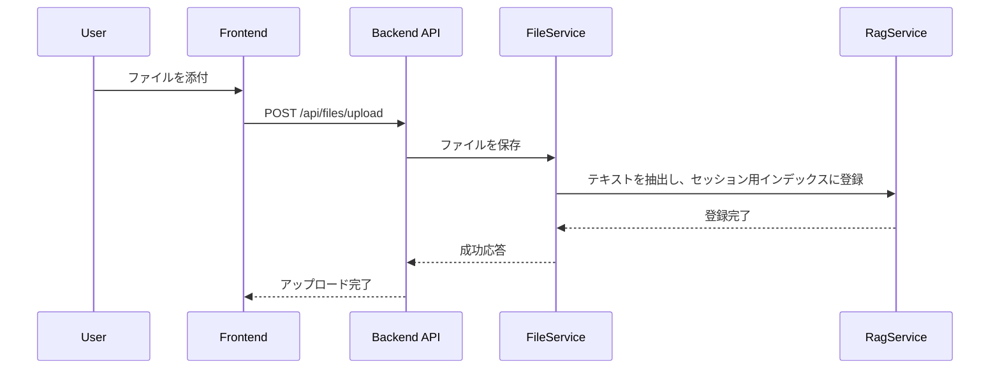

# 技術設計書: DOM Enterprise Gateway P0 Core Chat

## 1. 概要
本文書は、「DOM Enterprise Gateway PoC Core Chat」機能の技術設計を定義する。要件定義書で示された「WHAT」を、具体的なアーキテクチャ、コンポーネント、データモデル、インターフェース仕様といった「HOW」に落とし込むことを目的とする。

### 1.1. 設計目標
- **要件の網羅:** 承認されたすべての機能要件・非機能要件を設計に反映する。
- **拡張性と保守性:** Kiroステアリング（`tech.md`, `structure.md`）の指針に従い、将来の機能拡張や変更が容易な、疎結合でクリーンなアーキテクチャを構築する。
- **型安全性:** PydanticとTypeScriptを活用し、バックエンドとフロントエンド間のデータ契約と内部処理の型安全性を確保する。

### 1.2. スコープ外
- P1以降の機能（高度なAgentic RAG、本格的なAgentOpsダッシュボードなど）の詳細設計。
- インフラのプロビジョニングコード（Terraformなど）の設計。

---

## 2. アーキテクチャ

### 2.1. アーキテクチャパターンと境界マップ
本システムは、**レイヤードアーキテクチャ**を基本とし、BFF (Backend for Frontend) パターンを採用する。責務は「プレゼンテーション層 (Frontend)」、「アプリケーション層 (Backend API)」、「ビジネスロジック層 (Services)」、「データアクセス層 (Repositories)」に明確に分離される。


- **Frontend (Angular SPA):** ユーザーとの対話を担当するUI。
- **Backend (FastAPI):**
    - **API Routers:** HTTPリクエストの受付とレスポンスの返却。
    - **AuthService:** OIDCトークンを検証し、ユーザー認証を行う。
    - **Business Logic Services:** 中核的なビジネスロジック。`DomOrchestratorService`, `ChatService`, `RagService`, `MemoryService`などが含まれる。
    - **Data Repositories:** SQLAlchemyを介したデータベースとのやり取りをカプセル化する。
- **Data Stores:**
    - **PostgreSQL:** メインの永続化ストア。`pgvector`拡張を利用してベクトルデータも格納。
    - **Redis:** セッションロックや短期的なキャッシュに使用。

### 2.2. 技術スタック
| Layer | Choice / Version | Role in Feature | Notes |
|-------|------------------|-----------------|-------|
| Frontend | Angular (LTS) | UI/UXの構築 | Signalsを状態管理の主軸とする |
| Backend | Python 3.12, FastAPI | APIサーバーとビジネスロジック | 非同期処理を全面的に活用 |
| LLM/RAG | LangChain v1 | RAGチェーンとエージェントロジックの構築 | LCELをベースに実装 |
| Data/Storage | PostgreSQL 15+, pgvector, Redis | 永続データ、ベクトルデータ、キャッシュ | 既存のDBをRAGにも活用し、アーキテクチャをシンプルに保つ |
| Authentication | `authlib` for Python | OIDCトークンの検証 | 標準的なライブラリでセキュリティを確保 |

---

## 3. システムフロー

### 3.1. 通常チャットフロー (シーケンス図)
`REQ-CHAT-1`, `REQ-CHAT-2`, `REQ-CHAT-3`, `REQ-RAG-1`



### 3.2. Ephemeral RAG フロー (ファイル添付時)
`REQ-RAG-3`, `REQ-FILE-1`



---

## 4. コンポーネントとインターフェース

### 4.1. Backend

#### `AuthService`
| Field | Detail |
|---|---|
| Intent | OIDCトークンを検証し、現在のユーザー情報を解決する |
| Requirements | `REQ-AUTH-1`, `REQ-AUTH-6` |

**Responsibilities & Constraints**
- OIDC IdPの公開鍵を取得し、JWTの署名とクレームを検証する。
- 検証済みのユーザー情報をリクエストコンテキストに格納する。

**Contracts**: Service

```python
# app/services/auth_service.py (Conceptual)
from pydantic import BaseModel

class AuthenticatedUser(BaseModel):
    id: str
    email: str
    roles: list[str]
    tenant_id: str

class AuthService:
    async def get_current_user(self, token: str) -> AuthenticatedUser:
        """
        Validates the OIDC token and returns the authenticated user's data.
        Raises an exception if the token is invalid.
        """
        pass
```

#### `DomOrchestratorService`
| Field | Detail |
|---|---|
| Intent | ユーザーの入力を解釈し、適切なエージェントやサービスを呼び出す司令塔 |
| Requirements | `REQ-CHAT-3`, `REQ-RAG-6`, `REQ-MEM-1` |

**Responsibilities & Constraints**
- 通常モードとリサーチモードを切り替える。
- `HelperAgent`, `ResearchAgent`, `AnswerAgent`の処理フローを制御する。
- LCELを使用して、RAGチェーンやエージェントチェーンを構築・実行する。

**Contracts**: Service

```python
# app/services/orchestration_service.py (Conceptual)
from typing import AsyncGenerator

class DomOrchestratorService:
    async def process_message(
        self, user_message: str, session_id: str, is_research_mode: bool
    ) -> AsyncGenerator[str, None]:
        """
        Processes the user's message, orchestrates agents, and yields the response tokens.
        """
        # 1. Determine agentic plan if needed
        # 2. Build and invoke LCEL RAG/Agent chain
        # 3. Yield tokens from the final LLM response
        pass
```

#### `ChatService`
| Field | Detail |
|---|---|
| Intent | チャットセッションのライフサイクル（開始、終了、Reset）を管理する |
| Requirements | `REQ-MEM-5`, `REQ-MEM-6`, `REQ-MEM-7` |

**Responsibilities & Constraints**
- `/reset` 実行時にResetインバリアントを保証する。
- セッションの永続化と状態変更を`ChatSessionRepository`を通じて行う。

**Contracts**: Service

```python
# app/services/chat_service.py (Conceptual)
class ChatService:
    async def reset_session(self, session_id: str, force: bool = False) -> str:
        """
        Resets the session. If force is False, summarizes the session first.
        Returns the new session_id.
        """
        pass
```

### 4.2. APIエンドポイント
| Method | Endpoint | Request Body | Response | Key Requirements |
|---|---|---|---|---|
| POST | `/api/chat/send` | `ChatMessageRequest` | `StreamingResponse` | `REQ-CHAT-1`, `REQ-CHAT-2` |
| GET | `/api/auth/me` | - | `UserResponse` | `REQ-AUTH-1` |
| POST | `/api/chat/reset` | `ResetRequest` | `{"new_session_id": "..."}` | `REQ-MEM-6`, `REQ-MEM-7` |
| POST | `/api/files/upload` | `UploadFile` | `FileResponse` | `REQ-FILE-1` |
| GET | `/api/admin/knowledge` | - | `list[KnowledgeDocResponse]`| `REQ-FILE-4` |
| POST | `/api/feedback` | `FeedbackRequest` | `{"status": "ok"}` | `REQ-UX-1` |

---

## 5. データモデル

### 5.1. 論理データモデル (Pydantic & SQLAlchemy)
型安全性を確保するため、APIのスキーマはPydanticで、DBモデルはSQLAlchemyで定義する。

#### `ChatMessage` (API Schema)
```python
# app/schemas/chat_schemas.py
from pydantic import BaseModel

class ChatMessageRequest(BaseModel):
    session_id: str
    text: str
    is_research_mode: bool = False

class ChatMessageResponse(BaseModel):
    id: int
    session_id: str
    text: str
    role: str  # "user" or "assistant"
    sources: list[dict] = []
```

#### `User` (DB Model)
```python
# app/models/user.py
from sqlalchemy.orm import Mapped, mapped_column
from .base import Base

class User(Base):
    __tablename__ = "users"
    id: Mapped[int] = mapped_column(primary_key=True)
    email: Mapped[str] = mapped_column(unique=True, index=True)
    role: Mapped[str] = mapped_column(default="user") # "user" or "admin"
    tenant_id: Mapped[int] = mapped_column(index=True)
```

#### `ChatSession` (DB Model)
```python
# app/models/chat.py
from sqlalchemy.orm import Mapped, mapped_column
from .base import Base

class ChatSession(Base):
    __tablename__ = "chat_sessions"
    id: Mapped[int] = mapped_column(primary_key=True)
    user_id: Mapped[int] = mapped_column(index=True)
    tenant_id: Mapped[int] = mapped_column(index=True)
    # ... other metadata
```

---

## 6. エラーハンドリング
- **Validation-Error (422):** Pydanticによるリクエストボディのバリデーション失敗時にFastAPIが自動返却。
- **Authentication-Error (401/403):** `AuthService`でのトークン検証失敗時。
- **Not-Found-Error (404):** 指定されたリソースが見つからない場合。
- **Server-Error (500):** 予期せぬ内部エラー。エラー内容はログに記録し、ユーザーには汎用的なメッセージを返す。

---

## 7. テスト戦略
- **ユニットテスト (pytest):**
  - 各Serviceのビジネスロジックを、RepositoryやLLM Clientをモックしてテストする。
  - Resetインバリアントなど、重要なロジックを重点的に検証する。
- **結合テスト (pytest + httpx):**
  - FastAPIの`TestClient`を使用し、APIエンドポイントレベルでのテストを実施。
  - OIDC認証部分はモックする。
  - テスト用のDBをコンテナで起動し、実際のデータ永続化を含めて検証する。
- **フロントエンドテスト (Jest):**
  - 主要なAngularコンポーネント（チャット画面など）の単体テスト。
  - Signalsを用いた状態変更がUIに正しく反映されることを検証する。
