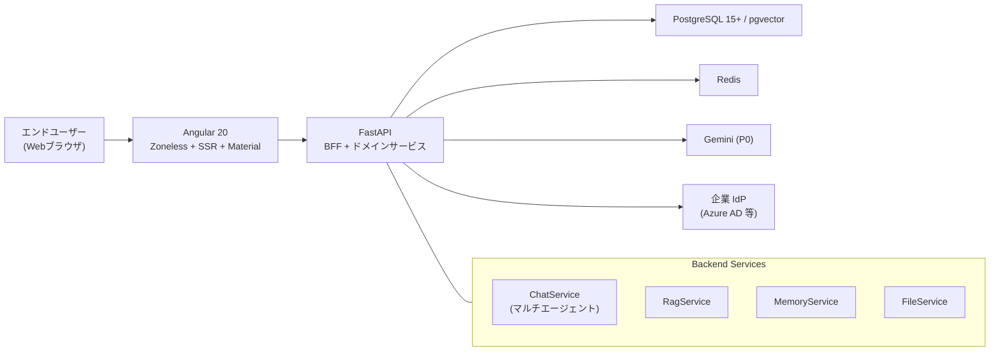

# DOM Enterprise Gateway – P0 Core Chat

DOM Enterprise Gateway の P0 コアチャット機能のリポジトリです。  
FastAPI + LangChain + PostgreSQL + Redis をベースに、OIDC 認証と RAG を備えた社内向けチャットゲートウェイを構築し、  
フロントエンドには Angular 20 + Zoneless + SSR + Angular Material (MD3) を採用しています。

---

## アーキテクチャ概要

アプリケーション全体の構成は次の通りです。


- User → Frontend: HTTPS
- Frontend → Backend: /api/* (BFF 経由)
- Backend → Postgres: SQL + pgvector
- Backend → Redis: セッション / キャッシュ
- Backend → LLM: LLM API (Gemini)
- Backend → IdP: OIDC

* Frontend:

  * Angular 20 / standalone / Zoneless / SSR
  * Angular Material (MD3) による UI
  * SSE によるチャットストリーミング表示
* Backend:

  * FastAPI + LangChain v1
  * OIDC + BFF パターン (アクセストークンはフロントに渡さない)
  * チャット / RAG / メモリ / ナレッジ / ファイル / フィードバック API

詳しい技術設計は `design.md` を参照してください。

---

## ディレクトリ構成

ルート直下:

* `backend/`
  FastAPI バックエンド本体。Poetry プロジェクト。
* `frontend/`
  Angular フロントエンド (Angular 20 + Zoneless + SSR + Material)。
* `.kiro/`
  cc-sdd / kiro による仕様 (`spec.json`) やタスクリスト (`tasks.md`)。
* `.gemini/`
  Gemini / Antigravity 用のメタデータ。
* `migrations/`
  Alembic マイグレーションファイル。
* `.env.example`
  環境変数のサンプル。
* `.env`
  実行環境用の秘密情報。**Git にはコミットしない。**
* `docker-compose.yml`
  backend + PostgreSQL + Redis をまとめて起動するための定義（WSL 上での動作を想定）。

### バックエンド内部

* `backend/app/main.py` – FastAPI エントリポイント
* `backend/app/api/` – API ルーター (`auth`, `chat`, `files`, `admin`, `feedback` など)
* `backend/app/services/` – ドメインサービス (`auth_service`, `chat_service`, `dom_orchestrator`, `rag_service`, `memory_service` など)
* `backend/app/repositories/` – DB アクセス層
* `backend/app/models/` – SQLAlchemy モデル
* `backend/app/schemas/` – Pydantic スキーマ
* `backend/app/core/` – 設定 (`config.py`)、DB 接続 (`database.py`) など
* `backend/app/tests/` – pytest によるユニットテスト・API テスト

### フロントエンド内部（概要）

* `frontend/src/main.ts` – `bootstrapApplication()` による起動エントリ
* `frontend/src/app/app.ts` – standalone ルートコンポーネント (`app-root`)
* `frontend/src/app/app.config.ts` – Zoneless + SSR + Router + HttpClient 設定
* `frontend/src/app/app.routes.ts` – ルート定義

  * `/login`, `/auth/callback` (Auth)
  * `/` 配下に `chat`, `sessions`, `memory`, `knowledge`, `settings`, `help`
* `frontend/src/app/core/`

  * `models/` – `ApiError`, `User` などの共通モデル
  * `services/` – `ApiService`, `AuthService`, `StateService`
  * `guards/` – `AuthGuard`
* `frontend/src/app/layout/`

  * `main-layout/` – アプリケーションシェル (Header + Sidebar + RouterOutlet)
  * `header/` – ヘッダー (ユーザー情報 / ログアウトボタン)
  * `sidebar/` – サイドバー (RBAC 対応メニュー)
* `frontend/src/app/features/auth/`

  * `login-page/` – ログイン画面
  * `auth-callback/` – OIDC コールバック画面

---

## 開発環境

* Windows 11 + **WSL2 (Ubuntu)**
* Python 3.12
* Poetry 1.8 以降
* Node.js / npm (WSL 内)
* (任意) Docker / docker-compose

> 重要: すべての CLI (`poetry`, `npm`, `ng`, `docker`) は **WSL2 内の Ubuntu ターミナルで実行**してください。

---

## 初期セットアップ

### 1. 共通: 環境変数ファイルの作成

```bash
# WSL 上で
cd ~/work/dom-enterprise-gateway
cp .env.example .env   # 必要に応じて中身を編集
```

最低限、このあたりの値を設定します（PoC 用にダミーでも可）:

* `OIDC_CLIENT_ID`
* `OIDC_CLIENT_SECRET`
* `INITIAL_ADMIN_EMAIL`

### 2. バックエンドのセットアップ

```bash
# WSL 上で
cd ~/work/dom-enterprise-gateway/backend

# Poetry で依存関係をインストール
poetry install

# 仮想環境をプロジェクト直下に作る場合（任意）
poetry config virtualenvs.in-project true
```

#### テスト実行

```bash
cd ~/work/dom-enterprise-gateway/backend

# すべてのテスト
poetry run pytest app/tests

# 特定のテストファイル
poetry run pytest app/tests/test_auth_service.py -vv
```

#### 開発用サーバー起動

```bash
cd ~/work/dom-enterprise-gateway/backend
poetry run uvicorn app.main:app --reload --host 0.0.0.0 --port 8000
```

---

### 3. フロントエンドのセットアップ

```bash
# WSL 上で
cd ~/work/dom-enterprise-gateway/frontend

# 依存パッケージのインストール（初回のみ）
npm install
```

#### 開発用サーバー起動

```bash
cd ~/work/dom-enterprise-gateway/frontend
npm start  # ng serve --host 0.0.0.0 --port 4200 相当
```

ブラウザから `http://localhost:4200` にアクセスします。

* Backend / OIDC を起動していない状態では、`/login` 画面が表示され、
  「ログインする」ボタンを押しても同じ画面のままなのは正常です。

---

## Git 運用と AI エージェント利用ガイドライン

* `.gitignore` により `.venv/`, `.gemini/`, `.pytest_cache/`, `.env`, `node_modules/` などは Git 管理から除外しています。
* 仕様ファイル `.kiro/` と `backend/` / `frontend/` は Git 管理対象です。
* AI エージェントによる大規模な修正は、専用ブランチ上で行い、必要な変更のみを `main` にマージする運用を推奨します。
* 重大な変更前にはタグ (例: `backup-before-agent-YYYYMMDD`) を打っておくと安全にロールバックできます。

### エージェントへの指示（要約）

* 既存ファイルの有無を必ず確認してから `NEW` / `MODIFY` を判断すること。
* エラーは「ネットワーク / 4xx / 5xx / タイムアウト / JSON パース / SSE 切断 / 認証 / 権限 / 予期せぬ例外」など、
  **考えうるすべてのパターンを分類してハンドリング**すること。
* クラス / メソッド / 関数には、日本語で「役割・いつ呼ばれるか・なぜこの実装か」をコメントで残すこと。
* 詳細な学習用解説は `frontend_*.md` など別ファイルで作成すること。
* 引き継ぎ前には、この README.md を最新状態に更新すること（Backend / Frontend / アーキテクチャ / 起動手順）。