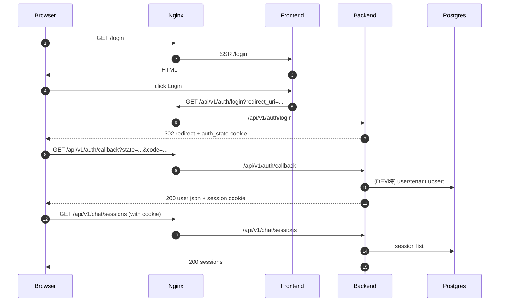

# DOM Enterprise Gateway

Enterprise向けの **ガバナンス付き LLM ゲートウェイ**の PoC（P0 Core Chat）です。

* Backend: **FastAPI + LangChain v1 + PostgreSQL(pgvector) + Redis**
* Frontend: **Angular 20 (standalone) + Signals + Zoneless + SSR + Angular Material (MD3)**
* PoC機能: マルチエージェント（DOM / Helper / Research / Answer）、長期メモリ、RAG、フィードバック、管理者向けナレッジ閲覧、設定/ヘルプ

> 開発は **Windows + WSL2 (Ubuntu)** 前提です。`npm` / `ng` / `poetry` / `docker` などのCLIは **WSL2 側で実行**してください。

---

## 1. 一次ソース（仕様の基準）

迷ったらまずここに立ち返ります。

* `requirements_p0_core_chat.md`（P0 の FR / NFR）
* `DOM Enterprise Gateway.txt`（全体サマリ / Project Memory 対応）
* `design.md`（アーキテクチャ / 図 / シーケンス）
* `.kiro/tasks.md`（実装タスク）

---

## 2. アーキテクチャ

### 2.1 全体構成

```mermaid
flowchart LR
  U[User Browser] -->|HTTP :80| N[Nginx]
  N -->|/ (SSR)| F[Frontend (Angular SSR)]
  N -->|/api → /api/v1/*| B[Backend (FastAPI)]

  B -->|SQLAlchemy| P[(PostgreSQL + pgvector)]
  B -->|cache / queues| R[(Redis)]

  B -->|LLM calls| L[(LLM Provider)]
  B -->|RAG| P

  subgraph Containers (docker compose)
    N
    F
    B
    P
    R
  end
```

### 2.2 代表的なリクエストフロー



---

## 3. リポジトリ構成（主要）

```
.
├── backend/          # FastAPI / LangChain / DB
├── frontend/         # Angular SSR (Zoneless)
├── nginx/            # reverse proxy (docker)
├── docs/             # E2Eシナリオ / リグレッション等
└── docker-compose.yml
```

---

## 4. 開発環境（WSL2）

* OS: Windows 11
* 実行環境: **WSL2 (Ubuntu)**
* 作業ディレクトリ例: `~/work/dom-enterprise-gateway`

> npm / node / ng / poetry は **WSL2 側に入っているもの**を使ってください。

---

## 5. 起動方法（Docker Compose / P0.1）

### 5.1 起動

```bash
# WSL2
cd ~/work/dom-enterprise-gateway
docker compose up --build -d
```

* ブラウザ: `http://localhost/`
* Nginx: `http://localhost/`（80）
* Backend: Nginx 経由で `http://localhost/api/v1/...`

### 5.2 Dev認証（P0.1）

P0.1 では「**最小コストで操作できるPoC**」のため、IdPなしの **Dev 認証**を用意しています。

* `DEV_AUTH_ENABLED=true` のときのみ有効
* `/api/v1/auth/login -> /api/v1/auth/callback` で **HttpOnly cookie セッション**を発行

> 本番運用では必ず `DEV_AUTH_ENABLED=false` にしてください。

### 5.3 DB 自動作成（P0.1）

PoC用途で、テーブル未生成による 500 を避けるためのオプションがあります。

* `AUTO_CREATE_DB=true` のとき、起動時に `Base.metadata.create_all()` でテーブルを自動作成します。

> 本番は Alembic マイグレーションで管理してください（自動DDLはOFF推奨）。

---

## 6. テスト（WSL2）

### 6.1 Backend

```bash
cd ~/work/dom-enterprise-gateway/backend
poetry install
poetry run pytest
```

### 6.2 Frontend

```bash
cd ~/work/dom-enterprise-gateway/frontend
npm ci
npm test -- --watch=false
```

#### Chrome/Chromium が無い場合

`ng test`（Karma / ChromeHeadless）が起動できない場合、WSL2 にブラウザ実体を入れる必要があります。

例:

```bash
# WSL2（環境により chromium / chromium-browser / google-chrome のいずれかが入ります）
which chromium || which chromium-browser || which google-chrome || true

# ない場合は導入（ディストリにより方法が異なります）
# sudo apt update && sudo apt install -y chromium

# 必要なら、CHROME_BIN を明示
export CHROME_BIN="$(which chromium || which chromium-browser || which google-chrome)"

npm test -- --watch=false --browsers=ChromeHeadless
```

---

## 7. 主要エンドポイント（抜粋）

* Auth

  * `GET /api/v1/auth/login?redirect_uri=...`
  * `GET /api/v1/auth/callback?state=...&code=...`
  * `POST /api/v1/auth/logout`
  * `GET /api/v1/auth/me`
* Chat

  * `GET /api/v1/chat/sessions`
  * `POST /api/v1/chat/messages`
  * `GET /api/v1/chat/stream`（SSE）
* Knowledge（Admin）

  * `GET /api/v1/admin/knowledge`
* Settings / Help

  * `GET /api/v1/user/settings`
  * `POST /api/v1/user/settings`
  * `GET /api/v1/help/content`

---

## 8. トラブルシューティング

### 8.1 401 が出る（Dev認証なのに）

* ブラウザの cookie が API に送られているか確認してください。
* Angular 側の HttpClient が `withCredentials: true` になっていないと cookie が送られません。

### 8.2 404 Not Found（/api が絡む）

* Nginx の `/api -> backend` ルーティングと、Frontend の API base path が一致しているか確認してください。
* `/api/api/...` のような二重パスになっている場合は、Frontend の base path と ApiService のパス組み立てを見直してください。

### 8.3 500 ResponseValidationError（datetime / updated_at）

* DB の `updated_at` が NULL のまま返ると、レスポンススキーマが strict な場合に 500 になり得ます。
* PoCでは `AUTO_CREATE_DB=true` の起動時処理で補正する運用にしています。

---

## 9. ロードマップ

### P0（Core Chat）

* Frontend 基盤（Angular SSR + Zoneless + Material MD3）
* 認証（BFF前提の入口）
* チャット UI（ストリーミング / 添付 / IC-5 Lite 表示）
* ナレッジ管理（管理者向け一覧・検索・詳細）
* Settings / Help（API連携 + UI）

### P0.1（操作できるPoC）

* Docker Compose で統合起動（Nginx / Frontend SSR / Backend / Postgres / Redis）
* Dev 認証（IdPなし、cookie セッション）
* PoC向け DB 自動作成（AUTO_CREATE_DB）

### P1

* **Auth本実装（BFF + OIDC / IdP: Keycloak 等）**
* Knowledge 管理の CRUD 拡張（アップロード / 削除 / 編集）
* ファイル内容プレビュー（特に PDF / Markdown）
* Settings/Help UI の UX 向上と Onboarding ツアーの多ステップ化
* RAG / Agentic Research の高度化

### P2 以降

* ガバナンスダッシュボード（フィードバック / ポリシー違反検知 / モデルルーティング）
* Explainability / トレースビュー
* 本番運用を想定した監査ログ・多テナント管理 UI など

---

## 10. ライセンス

TBD
