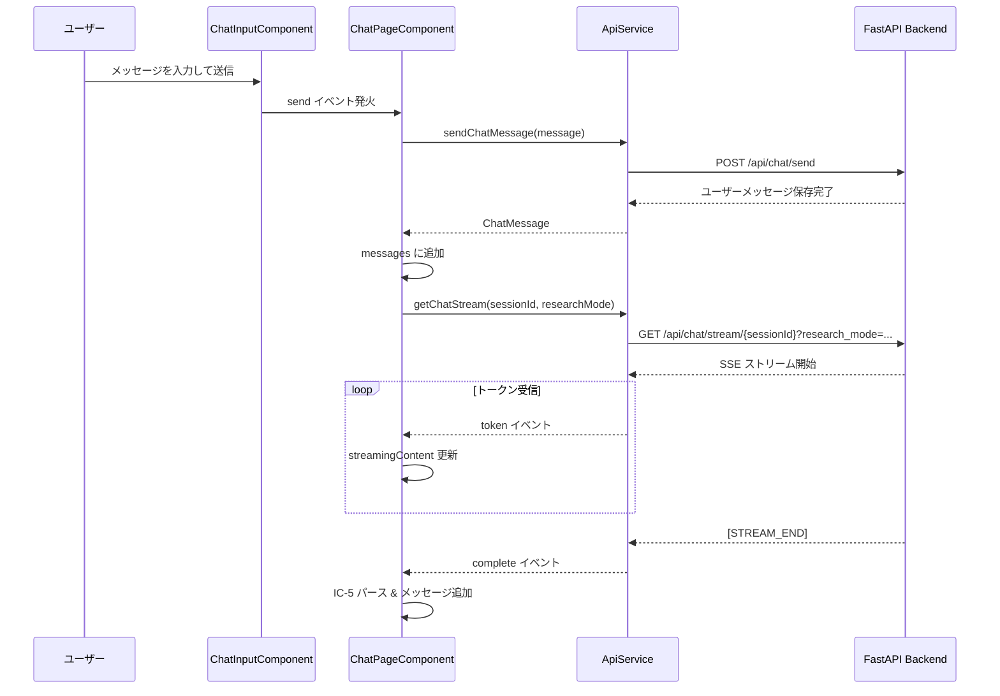
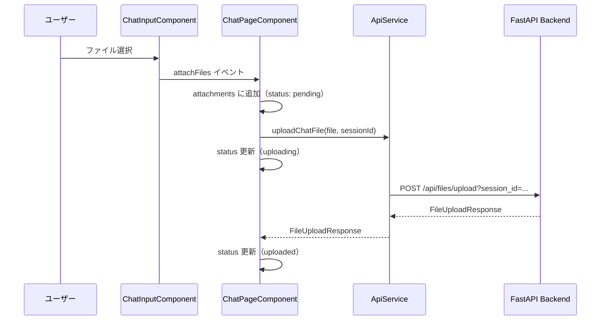

# Frontend 7.2: Chat UI 実装ガイド（初学者向け）

このドキュメントでは、Task 7.2 で実装したチャット UI の仕組みを、中学生にもわかるように解説します。

## 目次
1. [概要](#概要)
2. [コンポーネント構成](#コンポーネント構成)
3. [データの流れ](#データの流れ)
4. [主な機能](#主な機能)
5. [技術的な工夫](#技術的な工夫)

---

## 概要

Task 7.2 では、チャット機能を実現するために以下を実装しました：

- **メッセージの送受信**: ユーザーがメッセージを入力し、LLM（AI）から応答を受け取ります。
- **リアルタイムストリーミング**: AI の応答を少しずつリアルタイムで表示します（SSE: Server-Sent Events を使用）。
- **IC-5 ライト形式**: AI の応答を「Decision（結論）」「Why（理由）」「Next 3 Actions（次のステップ）」の3つのセクションに分けて表示します。
- **ファイル添付**: ユーザーがファイルをアップロードし、AI がそのファイルの内容を参照できるようにします。

---

## コンポーネント構成

チャット画面は以下の5つのコンポーネントで構成されています：

### 1. **ChatPageComponent** (親コンポーネント)
- **役割**: チャット機能全体を統括します。
- **責務**:
  - セッション管理（新しいチャットの開始 / リセット）
  - メッセージの送受信ロジック
  - ストリーミング応答の受信とパース
  - ファイルアップロード
  - エラーハンドリング

### 2. **MessageListComponent** (メッセージ一覧)
- **役割**: 過去のメッセージと現在ストリーミング中のメッセージを表示します。
- **特徴**:
  - ユーザーメッセージとAI メッセージを視覚的に区別
  - メッセージにソース（参照元）がある場合、チップで表示

### 3. **ChatInputComponent** (入力フォーム)
- **役割**: ユーザーがメッセージを入力するためのUIを提供します。
- **機能**:
  - テキスト入力（Enter で送信、Shift+Enter で改行）
  - サンプルプロンプト（テンプレート）のクイック挿入
  - リサーチモードトグル（高度な調査を有効化）
  - ファイル添付ボタン

### 4. **Ic5ViewerComponent** (IC-5 形式表示)
- **役割**: AI の応答を IC-5 ライト形式でタブ表示します。
- **表示内容**:
  - Decision（結論）
  - Why（理由）
  - Next 3 Actions（次の3つのアクション）
  - パース警告（Markdown 解析時のエラー）

### 5. **AttachmentListComponent** (ファイル添付一覧)
- **役割**: アップロード中・成功・失敗したファイルの状態を表示します。
- **状態**:
  - `pending`: アップロード待機中
  - `uploading`: アップロード中（プログレスバー表示）
  - `uploaded`: アップロード完了
  - `failed`: アップロード失敗（エラーメッセージ表示）

---

## データの流れ

### メッセージ送信から応答受信までの流れ



### ファイルアップロードの流れ



---

## 主な機能

### 1. リアルタイムストリーミング（SSE）

**仕組み**:
- Backend は `GET /api/chat/stream/{session_id}` で SSE 接続を提供します。
- Frontend は `EventSource` オブジェクトを使ってこの SSE に接続します。
- Backend からトークン（文字列の断片）が送信されると、Frontend はリアルタイムで `streamingContent` に追加します。

**コード例（ApiService.getChatStream）**:
```typescript
const eventSource = new EventSource(url, { withCredentials: true });

eventSource.onmessage = (event) => {
  const token = event.data;
  
  if (token === '[STREAM_END]') {
    onComplete();
    eventSource.close();
    return;
  }

  onToken(token); // トークンを親コンポーネントに通知
};
```

### 2. IC-5 ライト形式のパース

**Markdown 形式の例**:
```markdown
## Decision
お客様のニーズに合わせてプランAを推奨します。

## Why
プランAはコスト効率が高く、長期的な運用に適しています。

## Next 3 Actions
1. プランAの詳細資料を確認
2. 予算の承認を得る
3. 実装スケジュールを調整
```

**パース処理（parseIc5Markdown 関数）**:
- 正規表現で `## Decision`, `## Why`, `## Next 3 Actions` セクションを抽出します。
- Next 3 Actions は番号付きリストまたは箇条書きを配列に変換します。

### 3. エラーハンドリング

**エラーの種別（ChatErrorKind）**:
- `network`: オフライン / DNS / CORS エラー
- `http-4xx`: 認証 / 認可 / バリデーションエラー
- `http-5xx`: サーバー内部エラー
- `sse`: SSE ストリーム切断
- `validation`: フロント側バリデーションエラー（ファイルサイズ超過など）
- `timeout`: タイムアウト
- `parse`: JSON パースエラー
- `unknown`: その他

**エラー表示**:
- エラーが発生すると、`MatSnackBar` でユーザーに通知します。
- エラーの種別に応じて、適切なメッセージとアクション（再試行 / ヘルプリンク）を表示します。

---

## 技術的な工夫

### 1. Signals による状態管理

Angular Signals を使ってリアクティブな状態管理を実現しています：

```typescript
// 状態定義
currentSessionId = signal<string | null>(null);
messages = signal<ChatMessage[]>([]);
isStreaming = signal<boolean>(false);

// 算出プロパティ（computed）
isBusy = computed(() => 
  this.isStreaming() || this.attachments().some(a => a.status === 'uploading')
);
```

**メリット**:
- 状態が変更されると、UI が自動的に更新されます（Zone.js不要）。
- 細かい変更検知が不要なため、パフォーマンスが向上します。

### 2. SSR 対応

**課題**: `EventSource` や `window` などのブラウザ専用APIは、サーバー側レンダリング（SSR）では使用できません。

**対策**:
- `EventSource` は SSR 時には実行されません（`ngOnInit` で動的に作成）。
- 将来的に `isPlatformBrowser` を使ってブラウザ専用処理をガードすることも可能です。

### 3. ファイルアップロードのバリデーション

**クライアント側チェック**:
```typescript
const MAX_FILE_SIZE = 5 * 1024 * 1024; // 5MB
if (file.size > MAX_FILE_SIZE) {
  throw {
    kind: 'validation',
    message: 'ファイルサイズが大きすぎます。5MB以下のファイルを選択してください。'
  } as ChatError;
}
```

**サーバー側チェック**:
- Backend でもファイルサイズ・形式をチェックし、エラーを返します。

---

## まとめ

Task 7.2 で実装したチャット UI は、以下の特徴を持ちます：

- **リアルタイム**: SSE でストリーミング応答を実現
- **構造化**: IC-5 ライト形式で AI の思考プロセスを可視化
- **柔軟性**: ファイル添付・リサーチモードなど、高度な機能をサポート
- **堅牢性**: 詳細なエラーハンドリングとバリデーション

次のステップ（Task 7.3）では、ナレッジ管理画面を実装します！
